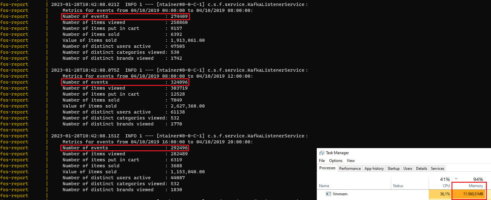

<h1>FOS: Fictive Online Store</h1>

This is a data engineering demo project. 
It contains a fos-producer microservice mocking user events generated by an e-commerce store, 
Kafka messaging, PySpark for aggregating the user event to metrics, 
a PostgreSQL DB for storing the metrics and a fos-report consumer microservice for logging the metrics.

<h2>Local setup</h2>
<ol>
<li>Download Docker Desktop (if not already installed) and make sure the docker deamon is running.</li>
<li>Clone or download and unzip the repository.</li>
<li>The repository includes only a small subset of data for development purposes, due to the full data set being 5GB in size. 
For testing with the full data set please download '2019-Oct.csv' at (https://www.kaggle.com/datasets/mkechinov/ecommerce-behavior-data-from-multi-category-store?resource=download&select=2019-Oct.csv).
The file needs to be placed in the 'data' folder and the INPUT_FILE_NAME at the top of the .env needs to be adjusted to the new file name.
</li>
<li>You may change other configurations as desired, see configuration section.</li>
<li>Open a shell at the root of the project and run <strong>docker compose up --build</strong></li>
<li>The containers should start and after a startup period (may take quite long for the first time, due to the docker images being several GB in size) 
you should be able to observe in the opened shell fos-producer sending events and fos-report logging the aggregated metrics.</li>
</ol>

<h2>Configuration</h2>
The following configurations can be adjusted in the .env file in the root of the project.
<ul>
<li>
INPUT_FILE_NAME: needs to match the name of the csv to read from the data folder.
Should fos-producer crash on startup and throw and exception, you may have misconfigured this value.
</li>
<li>
PRODUCER_DATA_SEC_PER_REAL_SEC: determines how fast data is read from the csv. 
1 is real time, 60 e.g. means 1 minute of csv data is sent per real time second. 
Probably the main configuration you want to adjust to do loadtests of different sizes.
</li>
<li>
PRODUCER_STARTUP_DELAY_IN_SEC: small delay before event production is started, just so all container can settle and are ready.
You may want to adjust this value if containers for some reason need to take longer to get up and running on your machine, but normally you should not need to touch this setting.
</li>
<li>
PRINT_PRODUCER_LOGS: when set to false, disables log messages for events being produced by fos-producer.
May be useful on a high PRODUCER_DATA_SEC_PER_REAL_SEC setting, to avoid spam.
</li>
</ul>

<h2>Performance</h2>
The main limitation of the load the system is able to manage is the available memory.
Using PRODUCER_DATA_SEC_PER_REAL_SEC=14400 (4 hours of data per second), 
we can see that the system is able the handle around 300000 messages per second at 12GB memory usage.

